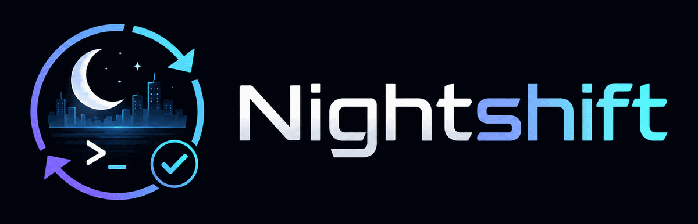

<p align="center">
  
</p>

<p align="center">
  <em>Your agent works the night shift. You keep the rulings.</em>
</p>

<p align="center">
  <a href="https://github.com/MissingPackage/nightshift/actions/workflows/gates.yml"></a>
  <a href="LICENSE"></a>
  
  
  
  
  
</p>

---

**A harness for long-horizon Claude Code work.** Goals decomposed into loop-runnable phases,
hooks that catch the sessions where discipline usually goes first, iterations verified by an
independent agent, and decisions that stay yours.

Claude Code is very good for an hour. The problems start at hour nine, on day three, at 11pm
when something is broken and you have no patience left: context is lost, claims stop carrying
evidence, "done" starts meaning "I ran out of ideas", and a plan applied to 30% of its sites
reads as finished. Nightshift is the scaffolding for that part — **state lives in files, not in
the conversation**, so the next session re-anchors from disk and continues.

It runs on itself. Every convention here is enforced on this repository by the gates in
`tests/`.

---

## What you get

| | | |
|---|---|---|
| **7 skills** | `root-cause` · `done` · `handoff` · `loop-iteration` · `goal-setup` · `spec-first` · `peripheral-vision` | discipline that triggers on its own |
| **8 hooks** | `firefight-catch` · `session-anchor` · `push-guard` · `strip-ai-attribution` · `handoff-freshness` · `loop-guard` · `loop-state` · `notify-ntfy` | mechanical rails, not reminders |
| **4 agents** | `loop-verifier` · `adversarial-reviewer` · `scout` · `consistency-sweep` | independent verification with its own context |
| **7 commands** | `/goal-brief` · `/handoff` · `/morning` · `/pr-message` · `/product-loop` · `/research-loop` · `/weekly-maintenance` | the rituals, automated |
| **5 workflows** | `sdd-conductor` · `pattern-coverage` · `pattern-migration` · `second-opinion` · `research-campaign` | deterministic multi-agent orchestration |
| **The protocol** | [`ORCHESTRATION.md`](ORCHESTRATION.md) | goals → phases → loops → rulings |
| **The recipes** | [`docs/COOKBOOK.md`](docs/COOKBOOK.md) | eight end-to-end workloads |

Plus an installer with drift detection, a 90-case hook regression suite, a status line, git
guards, and systemd units for scheduled runs.

**The single idea:** make the good path the default path, so that using it at 11pm requires no
willpower.

---

## Install

Two channels. They install the same surface; pick one, not both.

### A. As a plugin (recommended)

```sh
/plugin marketplace add MissingPackage/nightshift
/plugin install nightshift@nightshift
```

Hooks are wired by `hooks/hooks.json` — nothing to merge by hand.

### B. With the installer

```sh
git clone https://github.com/MissingPackage/nightshift
cd nightshift
./install.sh --dry-run     # see exactly what would change; writes nothing
./install.sh --settings    # install, and merge hooks + statusLine into settings.json
./verify-install.sh        # 36 checks
```

| Flag | Effect |
|---|---|
| *(none)* | install skills, agents, commands, workflows, hud into `~/.claude`. `settings.json` untouched — each hook's header carries the snippet to merge by hand. |
| `--settings` | also merge the hooks block and statusLine into `settings.json`. Idempotent, backs up first, never clobbers other keys or a custom statusLine. |
| `--with-vendored` | also install the four vendored third-party skills (see [Third-party](#third-party) below). Off by default. |
| `--enterprise` | file-based surface only, no hooks, `settings.json` untouched — for environments where managed settings block hooks. See [`docs/ENTERPRISE.md`](docs/ENTERPRISE.md). |
| `--dry-run` | print what would change, write nothing. Composes with all of the above. |

Existing files that differ are backed up to `~/.claude/nightshift-backup-<epoch>/` before
overwrite; unchanged files are skipped, so a re-run reports `0 installed`.

### Verify it took (2 minutes)

`./verify-install.sh` checks the files. These four check the behaviour:

1. Start a session and type `done?` → a `[firefight-catch]` note appears telling the agent to
   answer with a report, not a bare yes.
2. Commit with a `Co-Authored-By:` trailer → it is stripped.
3. `git push` to a remote your `.harness/push-policy` does not allow → denied.
4. Create a `HANDOFF.md` with a `## 1. Next decidable` section → a new session echoes it back.

If any of these does nothing, the hooks are not registered: re-run with `--settings`, or check
that `settings.json` is valid JSON.

---

## Using it

### Interrupt work — the 11pm path

Nothing to invoke. Paste the error. `firefight-catch` sees the shape of the message — bare
polling, a 4KB traceback with no framing, fix-verbs with no cause named, the same message sent
twice in three minutes — and injects the rails. `root-cause` then blocks any edit until the
agent can complete *"it fails because ___, shown by ___"*, and it acquires its own observations
instead of asking you to re-test.

### Feature work — one session

`brainstorming` if the design is open → `spec-first` → implement → the `done` skill produces a
report you can audit: commands actually run with their real outcomes, what was **not** verified
and why, and what you should check by hand. A "done" without evidence is the failure mode this
exists to make impossible.

### Long-horizon work — goals and loops

```sh
/goal-brief add offline mode to the sync engine   # → a GOAL.md draft with [ASSUMED] markers
                                                  # you edit it; resolving them IS the exercise
/goal                                             # iteration 0: goal-setup writes PHASES.md
                                                  # you approve plan-check — a 60-second read
/loop /product-loop                               # it runs, and keeps itself alive
```

Each iteration: re-anchor from disk → work the first READY phase → `loop-verifier` grades the
phase's mechanical done-when → update PHASES.md, write a digest, refresh `HANDOFF.md` §1 →
schedule the next. State lives in `.harness/goals/<slug>/`, so a crash costs one iteration,
not the thread.

The loop stops itself in three ways, all deliberate: **all phases done** (final verification
against the goal contract, then a report), **an authority edge** (docket entry, phase blocked,
next phase taken), **no progress twice on the same phase** (blocked, then paused with a
notification). It does not grind until morning.

Read [`ORCHESTRATION.md`](ORCHESTRATION.md) for the state machine, the escalation ladder, the
unattended test, and the atrophy ledger — the section that names what automating judgment costs
you, instead of pretending it costs nothing.

Then read [`docs/COOKBOOK.md`](docs/COOKBOOK.md) for the eight recipes: nightly loop, research
campaign, greenfield build, firefight, pattern migration, deploy, second-opinion review, weekly
maintenance.

---

## Configuration

**Your own rules.** [`templates/CLAUDE.md`](templates/CLAUDE.md) is a starting `~/.claude/CLAUDE.md`
with `⟨FILL⟩` slots. Delete what you will not enforce — an instruction you ignore costs
attention in every session forever.

**Your own language.** The `firefight-catch` triggers are English. Add any language without
editing the hook, in `~/.config/nightshift/firefight-patterns.json`:

```json
{
  "polling":   ["fatto", "finito", "ci sei"],
  "firefight": ["non funziona", "è rotto", "lo fa ancora"],
  "cause":     ["perché", "causa", "ipotesi"]
}
```

`cause` is the suppression list: a prompt that names a cause is not a firefight. A malformed
config never breaks your prompt — it is ignored.

**Push policy.** `.harness/push-policy` in each project is deny-all until you add a rule. Both
the `push-guard` hook and the `pre-push` git hook read the same file, so the policy holds for
manual pushes too. Install the git guards with `tools/install-git-guards.sh`.

**Notifications.** Optional phone push. See [`docs/notify-setup.md`](docs/notify-setup.md).

**Scheduled runs.** `tools/install-schedules.sh` plus the units in `systemd/` for the morning
report and the loop watchdog. See [`docs/nightly-loop.md`](docs/nightly-loop.md).

---

## Honest limits

- **No evals in this release.** The harness has a measurement design — two arms, installed
  versus vanilla, driven headless against synthetic fixtures with planted bugs, scored
  deterministically, reporting the *breaking point* of each discipline rather than an average.
  It exists and it works, but its fixtures are not in English, and translating fixtures changes
  the treatment rather than the presentation: scores measured on renamed identifiers are not
  comparable to the originals. Rebuilding it properly is the v1.1 milestone. Shipping a
  mistranslated measuring instrument would be worse than shipping none.
- **The hooks are tested; the skills are less so.** `tests/run.sh` drives every hook with real
  JSON fixtures (90 cases). Skills are prompt-shaped artifacts and are verified by use, not by
  assertion.
- **`--enterprise` is a reduced product, not the same product.** Where managed settings block
  hooks, you keep the file-based surface and lose the mechanical enforcement. What survives and
  what does not is enumerated in [`docs/ENTERPRISE.md`](docs/ENTERPRISE.md).
- **Skill count is a budget, not a score.** The installed surface is deliberately small.
  Descriptions compete for the model's attention, and twenty skills means none of them trigger
  reliably.

---

## Contributing

Run `bash tests/run.sh` before opening a PR — 90 cases, hooks driven by piped JSON fixtures.
CI runs that plus `tests/check-references.sh`, `tests/check-no-secrets.sh`, a sandbox install
and verify in all four modes, an idempotency check, a negative case proving the drift sensor
can still fail, and shellcheck. It needs no secrets and requests read-only permissions.
Hooks follow one shape (`bash` → `python3` heredoc reading hook JSON on fd 3) so the suite can
drive them. Skills, commands and agents follow the shapes already in `skills/`, `commands/`,
`agents/`: frontmatter, Overview, steps, Common mistakes.

Prose convention, in docs and commits alike: dense, evidence-first, no filler. A claim about an
artifact carries the command that produced it and what that command actually printed.

## Third-party

Everything in this repository is original work, with one deliberate exception:
[`skills/vendored/`](skills/vendored/README.md) holds four skills from
[superpowers](https://github.com/obra/superpowers) by Jesse Vincent (MIT), kept as local copies
with four documented local adaptations. They are **not installed by default** — pass
`--with-vendored` if you want them. That directory's README explains the adaptations, why they
are vendored rather than depended on, and how to use upstream directly instead.

## License

MIT — see [`LICENSE`](LICENSE). The vendored skills carry their own upstream MIT notice in
[`skills/vendored/LICENSE-superpowers`](skills/vendored/LICENSE-superpowers).
