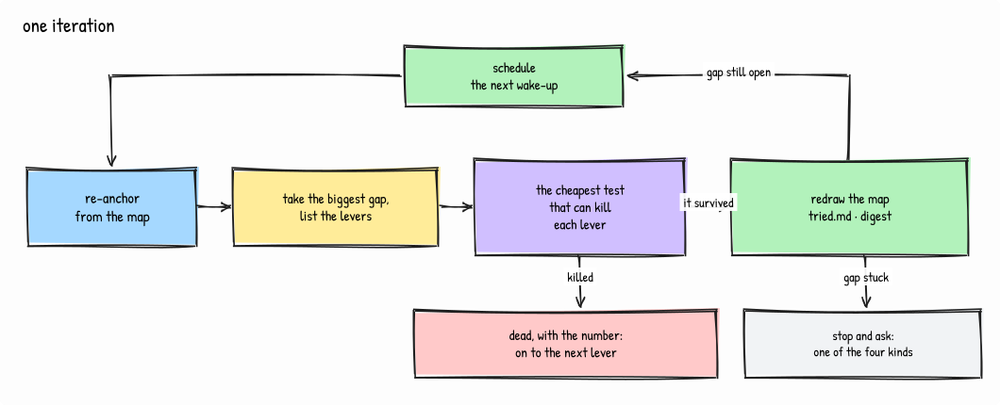

<p align="center">
  
</p>

<p align="center">
  <em>Your agent works the night shift. You keep the rulings.</em>
</p>

<p align="center">
  <a href="https://github.com/MissingPackage/nightshift/actions/workflows/gates.yml"></a>
  <a href="LICENSE"></a>
  
  
  
  
  
</p>

---

**A harness for long-horizon Claude Code work.** Goals decomposed into loop-runnable phases,
hooks that catch the sessions where discipline usually goes first, iterations verified by an
independent agent, and decisions that stay yours.

Claude Code is very good for an hour. The problems start at hour nine, on day three, at 11pm
when something is broken and you have no patience left: context is lost, claims stop carrying
evidence, "done" starts meaning "I ran out of ideas", and a plan applied to 30% of its sites
reads as finished. Nightshift is the scaffolding for that part — **state lives in files, not in
the conversation**, so the next session re-anchors from disk and continues.

It runs on itself. Every convention here is enforced on this repository by the gates in
`tests/`.

---

## What you get

| | | |
|---|---|---|
| **Work that outlives the session** | goals decomposed into phases, state in `.harness/goals/<slug>/` | a crash costs one iteration, not the thread |
| **Iterations graded by someone else** | `loop-verifier`, own context, read-only | a phase closes on its mechanical done-when, not on the agent's word for it |
| **A loop that runs unattended** | re-anchor → work the phase → verify → schedule the next | it keeps itself alive across sessions, and stops itself three ways |
| **Deterministic multi-agent orchestration** | 5 workflows: `sdd-conductor` · `pattern-migration` · `pattern-coverage` · `second-opinion` · `research-campaign` | scripts with real control flow, not a prompt asking for parallelism |
| **Rails you never invoke** | 8 hooks, fired by events | discipline that survives the hour when you have none |
| **The surface** | 7 skills · 4 agents · 8 commands — named under [Surface](#surface) | small on purpose: descriptions compete for the model's attention |

The protocol is [`ORCHESTRATION.md`](ORCHESTRATION.md) — goals → phases → loops → rulings — and
[`docs/COOKBOOK.md`](docs/COOKBOOK.md) has ten end-to-end workloads. Plus an installer with
drift detection, a 116-case hook regression suite, a status line, git guards, and systemd units
for scheduled runs.

**The single idea:** make the good path the default path, so that using it at 11pm requires no
willpower.

---

## Why this is not a skill collection

Three things a set of prompts cannot do, all of them mechanical:

- **A phase does not close because the agent says it did.** `loop-verifier` runs in a separate
  context, reads the phase's done-when, and returns PASS or FAIL with the command it ran. The
  loop cannot mark its own homework, which is the failure that makes long runs worthless.
- **The loop knows when to stop.** All phases done, an authority edge it must not cross on its
  own, or no progress twice on the same phase — it stops and tells you, instead of spending the
  night on a phase that is not moving.
- **A fix that exists in the repo but is not installed does not exist.** `verify-install.sh`
  compares the installed surface against the source and fails when they diverge — a real
  two-day divergence is why that check is there, and CI proves it can still say no.

---

## Install

Two channels. They install the same surface; pick one, not both.

### A. As a plugin (recommended)

```sh
/plugin marketplace add MissingPackage/nightshift
/plugin install nightshift@nightshift
/nightshift-setup                            # restart the session first, so the command exists
```

Hooks are wired by `hooks/hooks.json` — nothing to merge by hand. `/nightshift-setup` adds the
three things a plugin cannot carry: the workflows, `~/.claude/ORCHESTRATION.md` (skills cite it
by that path), and the status line. It installs nothing the plugin already provides, and
`verify-install.sh --plugin` fails if a second copy is ever found.

### B. With the installer

```sh
git clone https://github.com/MissingPackage/nightshift
cd nightshift
./install.sh --dry-run     # see exactly what would change; writes nothing
./install.sh --settings    # install, and merge hooks + statusLine into settings.json
./verify-install.sh        # 37 checks
```

| Flag | Effect |
|---|---|
| *(none)* | install skills, agents, commands, workflows, hud into `~/.claude`. `settings.json` untouched — each hook's header carries the snippet to merge by hand. |
| `--settings` | also merge the hooks block and statusLine into `settings.json`. Idempotent, backs up first, never clobbers other keys or a custom statusLine. |
| `--with-vendored` | also install the four vendored third-party skills (see [Third-party](#third-party) below). Off by default. |
| `--enterprise` | file-based surface only, no hooks, `settings.json` untouched — for environments where managed settings block hooks. See [`docs/ENTERPRISE.md`](docs/ENTERPRISE.md). |
| `--plugin` | complement channel A instead of duplicating it: workflows, `ORCHESTRATION.md` and the status line only. What `/nightshift-setup` runs for you. |
| `--dry-run` | print what would change, write nothing. Composes with all of the above. |

Existing files that differ are backed up to `~/.claude/nightshift-backup-<epoch>/` before
overwrite; unchanged files are skipped, so a re-run reports `0 installed`.

### Verify it took (2 minutes)

`./verify-install.sh` checks the files. These four check the behaviour:

1. Start a session and type `done?` → a `[firefight-catch]` note appears telling the agent to
   answer with a report, not a bare yes.
2. Commit with a `Co-Authored-By:` trailer → it is stripped.
3. `git push` to a remote your `.harness/push-policy` does not allow → denied.
4. Create a `HANDOFF.md` with a `## 1. Next decidable` section → a new session echoes it back.

If any of these does nothing, the hooks are not registered: re-run with `--settings`, or check
that `settings.json` is valid JSON.

---

## Using it

### Long-horizon work — goals and loops

```sh
/goal-brief add offline mode to the sync engine   # → a GOAL.md draft with [ASSUMED] markers
                                                  # you edit it; resolving them IS the exercise
/goal                                             # iteration 0: goal-setup writes PHASES.md
                                                  # you approve plan-check — a 60-second read
/loop /product-loop                               # it runs, and keeps itself alive
```

Each iteration: re-anchor from disk → work the first READY phase → `loop-verifier` grades the
phase's mechanical done-when → update PHASES.md, write a digest, refresh `HANDOFF.md` §1 →
schedule the next. State lives in `.harness/goals/<slug>/`, so a crash costs one iteration,
not the thread.

<p align="center"></p>

**Two loops, different contracts.** `/loop /product-loop` is for shipping: one slice per
iteration, small enough to implement *and* verify in the same iteration, work on a branch,
merges are a docket item rather than something it decides alone, and `consistency-sweep` blocks
a slice that applied a new pattern to only some of its sites. `/loop /research-loop` is for
finding out: the prediction is pre-registered **before** any spend, cost is estimated on a dry
run first, results are graded against what was predicted — negative results recorded with the
same care as positive ones — and two dry iterations hand the work back rather than trying a
third time.

The loop stops itself in three ways, all deliberate: **all phases done** (final verification
against the goal contract, then a report), **an authority edge** (docket entry, phase blocked,
next phase taken), **no progress twice on the same phase** (blocked, then paused with a
notification). It does not grind until morning, and it does not invent scope to stay alive:
when everything left needs a ruling, stopping *is* the correct ending, and the digest names the
rulings that are missing.

Read [`ORCHESTRATION.md`](ORCHESTRATION.md) for the state machine, the escalation ladder and
the unattended test — what the loop is allowed to decide alone, and what it must hand back.

Then read [`docs/COOKBOOK.md`](docs/COOKBOOK.md) for the ten recipes: nightly loop, research
campaign, greenfield build, firefight, pattern migration, deploy, second-opinion review, weekly
maintenance, taking over a codebase you did not write, and picking up a run that died.

### Multi-agent work — workflows

A workflow is a script that gives a run its **direction**; the run itself stays as dynamic as
the work is. The script owns the shape — who may run at once, what must finish before what,
which model does which job, where the ceiling is. What actually happens inside is decided at
runtime by agents reading real code.

**`sdd-conductor`** is the deepest of the five: a spec becomes working code without you brokering
the middle. The plan agent returns a task graph, and the graph is validated **in code** before a
single line is written — file ownership must be disjoint, dependencies acyclic, and every task's
done-when mechanically checkable. A plan that fails those checks is rejected by the runner, not
by another model's opinion of it. Waves fall out of the dependencies, and the tasks in a wave
run at once.

<p align="center"></p>

Each implementer works on its own copy of the project and returns a unified diff — it never
touches the shared tree — with a RED phase first whenever the done-when is testable. Only the
integrator applies patches, sequentially, in wave order, and a conflict blocks that task instead
of being auto-resolved. Two rounds of adversarial review stand between a patch and the tree, and
a surviving critical finding blocks the task **without stopping the build**: it comes back as a
docket entry, and the rest of the wave lands. The project's own suite runs after every wave, so
a build that went wrong is caught at the wave that broke it rather than at the end.

**`pattern-migration`** is the clearest case of a shape decided at runtime. One mapper — a strong
model — reads the codebase and *returns a plan*: which sites carry the old form, which files each
fixer may touch, and whether a plain verification could pass while the migration is wrong. The
script then spawns **one fixer per site the mapper found** — the width is discovered, not written
down — gives each an exclusive set of files so they cannot collide, and re-runs the mapper's own
count command to check the result. If the mapper asked for an adversarial pass, it gets exactly
one extra skeptic. Nothing about that run was fixed in advance except the guarantees.

<p align="center"></p>

**`second-opinion`** works the same way from the other end: three independent reviewers look at
one branch — two Claude lenses plus a Codex lens, deliberately a second model family — their
findings are merged and deduplicated, and then **one refuter is spawned per surviving finding**,
so the depth of verification follows what was found rather than a number someone guessed. The
report separates confirmed from refuted and hands you the contested ones, which are the only
part worth your attention. If the Codex CLI is missing or its auth expired, the gate runs on two
lenses and says so — never a failure over an absent reviewer.

<p align="center"></p>

**`research-campaign`** runs one work package, and the order is the whole point: the prediction is
pre-registered — with the metric and what would refute it — **before** anything is executed, so
grading cannot be arranged after the fact to match the result. Execution reports raw evidence and
the metric reading whatever it turns out to be. Then a grader that did not do the work judges the
mechanical comparison and may return *inconclusive*, which is a real verdict here rather than a
polite failure. The hand-back memo is assembled in code, not written by an agent: the format is
the contract.

<p align="center"></p>

**`pattern-coverage`** is the sensor the migration executor is paired with, and it answers one
question mechanically: how many sites actually follow this convention? One classifier per glob
group enumerates them, every site that looks non-compliant gets a skeptic that tries to prove it
compliant, and the result is n/total plus the exact worklist and the motivated exceptions. The
fan-out of skeptics is capped, and the sites past the cap stay in the worklist marked
*unverified* rather than quietly disappearing — a number that flatters itself is worse than no
number. The fix stays outside: this one measures, it does not touch code.

<p align="center"></p>

What the script guarantees, and an agent improvising cannot: exclusive file ownership inside a
wave, explicit models per job — never inherited from your session — a hard cap on fan-out, and
structured results validated against a schema instead of parsed out of prose. That rule about
models was paid for: one early run left the multiplier to a downstream agent and reached 57
agents on a pattern a `grep` could have counted.

Each file's header documents its contract, and the agent runs it by name:
`Workflow({name: "pattern-migration", args: {...}})`. The required args are not folklore —
`verify-install.sh` fails when a workflow's documented Invoke line stops naming every argument
its code demands.

### Feature work — one session

`brainstorming` if the design is open → `spec-first` → implement → the `done` skill produces a
report you can audit: commands actually run with their real outcomes, what was **not** verified
and why, and what you should check by hand. A "done" without evidence is the failure mode this
exists to make impossible.

### Interrupt work — the 11pm path

Nothing to invoke. Paste the error. `firefight-catch` sees the shape of the message — bare
polling, a 4KB traceback with no framing, fix-verbs with no cause named, the same message sent
twice in three minutes — and injects the rails. `root-cause` then blocks any edit until the
agent can complete *"it fails because ___, shown by ___"*, and it acquires its own observations
instead of asking you to re-test.


---

## Configuration

**Your own rules.** [`templates/CLAUDE.md`](templates/CLAUDE.md) is a starting `~/.claude/CLAUDE.md`
with `⟨FILL⟩` slots. Delete what you will not enforce — an instruction you ignore costs
attention in every session forever.

**Your own language.** The `firefight-catch` triggers are English. Add any language without
editing the hook, in `~/.config/nightshift/firefight-patterns.json`:

```json
{
  "polling":   ["fatto", "finito", "ci sei"],
  "firefight": ["non funziona", "è rotto", "lo fa ancora"],
  "cause":     ["perché", "causa", "ipotesi"]
}
```

`cause` is the suppression list: a prompt that names a cause is not a firefight. A malformed
config never breaks your prompt — it is ignored.

**Push policy.** `.harness/push-policy` in each project is deny-all until you add a rule. Both
the `push-guard` hook and the `pre-push` git hook read the same file, so the policy holds for
manual pushes too. Install the git guards with `tools/install-git-guards.sh`.

**Notifications.** Optional phone push. See [`docs/notify-setup.md`](docs/notify-setup.md).

**Scheduled runs.** `tools/install-schedules.sh` plus the units in `systemd/` for the morning
report and the loop watchdog. See [`docs/nightly-loop.md`](docs/nightly-loop.md).

---

## Honest limits

- **No evals in this release.** The harness has a measurement design — two arms, installed
  versus vanilla, driven headless against synthetic fixtures with planted bugs, scored
  deterministically, reporting the *breaking point* of each discipline rather than an average.
  It exists and it works, but its fixtures are not in English, and translating fixtures changes
  the treatment rather than the presentation: scores measured on renamed identifiers are not
  comparable to the originals. Rebuilding it properly is the v1.1 milestone. Shipping a
  mistranslated measuring instrument would be worse than shipping none.
- **The hooks are tested; the skills are less so.** `tests/run.sh` drives every hook with real
  JSON fixtures (116 cases). Skills are prompt-shaped artifacts and are verified by use, not by
  assertion.
- **`--enterprise` is a reduced product, not the same product.** Where managed settings block
  hooks, you keep the file-based surface and lose the mechanical enforcement. What survives and
  what does not is enumerated in [`docs/ENTERPRISE.md`](docs/ENTERPRISE.md).

---

## Surface

What lands in `~/.claude`, by kind:

- **7 skills** — `root-cause` · `done` · `handoff` · `loop-iteration` · `goal-setup` ·
  `spec-first` · `peripheral-vision`. They trigger on their own; none of them needs invoking.
- **8 hooks** — `firefight-catch` · `session-anchor` · `push-guard` · `strip-ai-attribution` ·
  `handoff-freshness` · `loop-guard` · `loop-state` · `notify-ntfy`.
- **4 agents** — `loop-verifier` · `adversarial-reviewer` · `scout` · `consistency-sweep`. Each
  gets its own context, which is the point: a reviewer sharing the author's context reviews its
  own reasoning.
- **8 commands** — `/goal-brief` · `/handoff` · `/morning` · `/pr-message` · `/product-loop` ·
  `/research-loop` · `/weekly-maintenance` · `/nightshift-setup`.
- **5 workflows** — `sdd-conductor` · `pattern-migration` · `pattern-coverage` ·
  `second-opinion` · `research-campaign`.

The skill count is a budget, not a score. Descriptions compete for the model's attention, and
twenty skills means none of them fire reliably.

## Contributing

Run `bash tests/run.sh` before opening a PR — 116 cases, hooks driven by piped JSON fixtures.
CI runs that plus `tests/check-references.sh`, `tests/check-no-secrets.sh`, a sandbox install
and verify in all four modes, an idempotency check, a negative case proving the drift sensor
can still fail, and shellcheck. It needs no secrets and requests read-only permissions.

**If you fix a bug, show the new case failing without the fix.** Stash the fix, or point the
suite at the previous version of the file, and confirm the case goes red — then restore it and
confirm green. A case that passes both ways is not covering the bug; it is decoration that will
read as coverage forever.

This is not a style preference. Fixing the hook that parses shell commands produced three new
cases, and only *one* of them failed against the broken version — the other two never reached
the defective code path at all, because an earlier filter returned first. Measured only after
the fix, all three looked like proof. The same thing happened four times in two days on this
project, which is why it is written down here instead of remembered.
Hooks follow one shape (`bash` → `python3` heredoc reading hook JSON on fd 3) so the suite can
drive them. Skills, commands and agents follow the shapes already in `skills/`, `commands/`,
`agents/`: frontmatter, Overview, steps, Common mistakes.

Prose convention, in docs and commits alike: dense, evidence-first, no filler. A claim about an
artifact carries the command that produced it and what that command actually printed.

## Third-party

Everything in this repository is original work, with one deliberate exception:
[`skills/vendored/`](skills/vendored/README.md) holds four skills from
[superpowers](https://github.com/obra/superpowers) by Jesse Vincent (MIT), kept as local copies
with four documented local adaptations. They are **not installed by default** — pass
`--with-vendored` if you want them. That directory's README explains the adaptations, why they
are vendored rather than depended on, and how to use upstream directly instead.

## License

MIT — see [`LICENSE`](LICENSE). The vendored skills carry their own upstream MIT notice in
[`skills/vendored/LICENSE-superpowers`](skills/vendored/LICENSE-superpowers).
