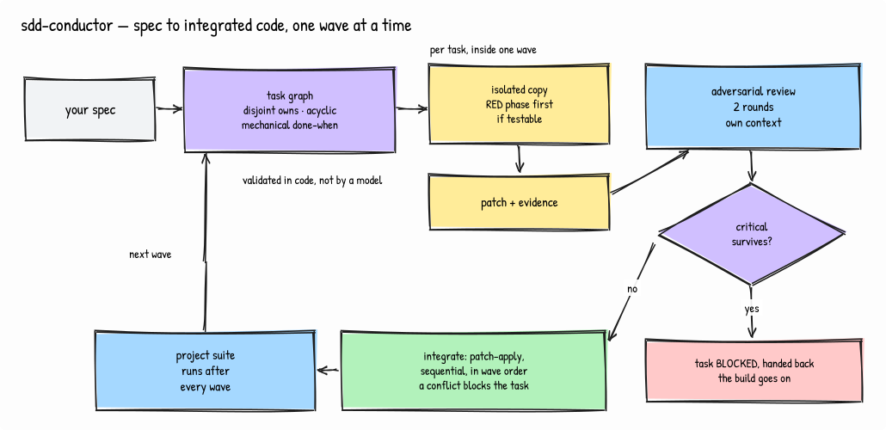
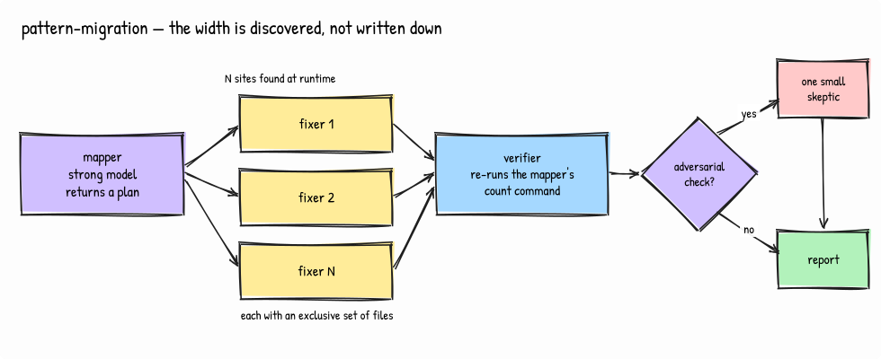
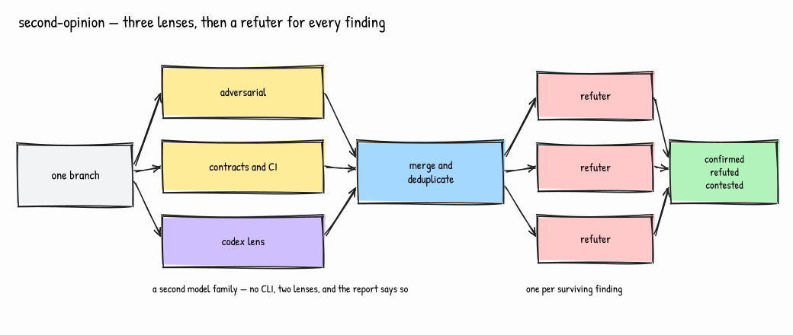
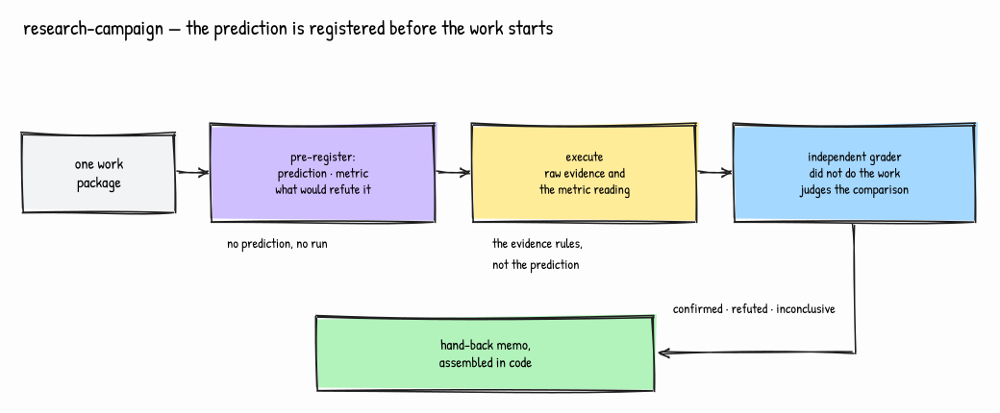
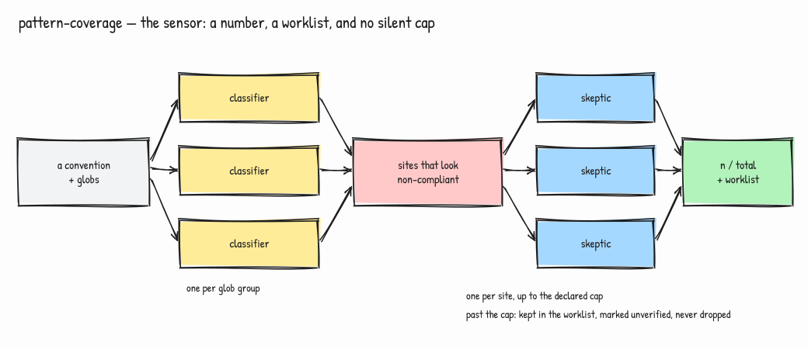

# The five workflows

A workflow is a script that gives a run its **direction**; the run itself stays as dynamic as
the work is. The script owns the shape — who may run at once, what must finish before what,
which model does which job, where the ceiling is. What actually happens inside is decided at
runtime by agents reading real code.

What the script guarantees, and an agent improvising cannot: exclusive file ownership inside a
wave, explicit models per job — never inherited from your session — a hard cap on fan-out, and
structured results validated against a schema instead of parsed out of prose. That rule about
models was paid for: one early run left the multiplier to a downstream agent and reached 57
agents on a pattern a `grep` could have counted.

Each file's header documents its contract, and the agent runs it by name:
`Workflow({name: "pattern-migration", args: {...}})`. The required args are not folklore —
`verify-install.sh` fails when a workflow's documented Invoke line stops naming every argument
its code demands.

Where each one sits in a whole goal is drawn in the [README](../README.md#using-it).

---

## sdd-conductor

It is the deepest of the five: a spec becomes working code without you brokering
the middle. The plan agent returns a task graph, and the graph is validated **in code** before a
single line is written — file ownership must be disjoint, dependencies acyclic, and every task's
done-when mechanically checkable. A plan that fails those checks is rejected by the runner, not
by another model's opinion of it. Waves fall out of the dependencies, and the tasks in a wave
run at once.

Each implementer works on its own copy of the project and returns a unified diff — it never
touches the shared tree — with a RED phase first whenever the done-when is testable. Only the
integrator applies patches, sequentially, in wave order, and a conflict blocks that task instead
of being auto-resolved. Two rounds of adversarial review stand between a patch and the tree, and
a surviving critical finding blocks the task **without stopping the build**: it comes back as a
docket entry, and the rest of the wave lands. The project's own suite runs after every wave, so
a build that went wrong is caught at the wave that broke it rather than at the end.

## pattern-migration

It is the clearest case of a shape decided at runtime. One mapper — a strong
model — reads the codebase and *returns a plan*: which sites carry the old form, which files each
fixer may touch, and whether a plain verification could pass while the migration is wrong. The
script then spawns **one fixer per site the mapper found** — the width is discovered, not written
down — gives each an exclusive set of files so they cannot collide, and re-runs the mapper's own
count command to check the result. If the mapper asked for an adversarial pass, it gets exactly
one extra skeptic. Nothing about that run was fixed in advance except the guarantees.

## second-opinion

It works the same way from the other end: three independent reviewers look at
one branch — two Claude lenses plus a Codex lens, deliberately a second model family — their
findings are merged and deduplicated, and then **one refuter is spawned per surviving finding**,
so the depth of verification follows what was found rather than a number someone guessed. The
report separates confirmed from refuted and hands you the contested ones, which are the only
part worth your attention. If the Codex CLI is missing or its auth expired, the gate runs on two
lenses and says so — never a failure over an absent reviewer.

## research-campaign

It runs one work package, and the order is the whole point: the prediction is
pre-registered — with the metric and what would refute it — **before** anything is executed, so
grading cannot be arranged after the fact to match the result. Execution reports raw evidence and
the metric reading whatever it turns out to be. Then a grader that did not do the work judges the
mechanical comparison and may return *inconclusive*, which is a real verdict here rather than a
polite failure. The hand-back memo is assembled in code, not written by an agent: the format is
the contract.

## pattern-coverage

It is the sensor the migration executor is paired with, and it answers one
question mechanically: how many sites actually follow this convention? One classifier per glob
group enumerates them, every site that looks non-compliant gets a skeptic that tries to prove it
compliant, and the result is n/total plus the exact worklist and the motivated exceptions. The
fan-out of skeptics is capped, and the sites past the cap stay in the worklist marked
*unverified* rather than quietly disappearing — a number that flatters itself is worse than no
number. The fix stays outside: this one measures, it does not touch code.

